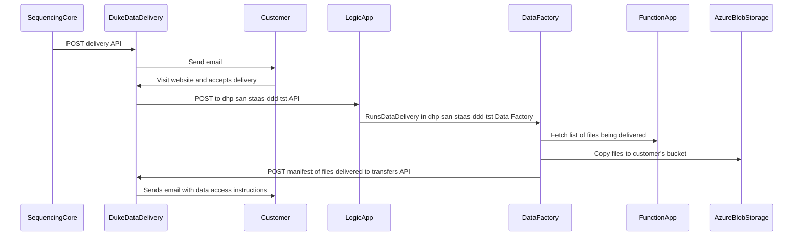

# Duke Data Delivery - Azure

## Sequencing Core
Sequencing Core staff use command line scripts on an OIT Linux VM at Duke to upload and deliver data.
These scripts use azcopy to upload data files to Azure Blob Storage.
Another python script is used to send a POST to Duke Data Delivery to begin delivery to the **Customer**.

## Duke Data Delivery (aka D4S2)
Website that allows users to deliver data to their customers. This website runs on a DHTS Linux VM at Duke.
The website sends an emails to the recipient with a link to accept delivery.
The website has no permissions in the Azure Blob Storage.

## Customer
Sequencing Core **Customer**(PI) that needs to take ownership of the data. The PI's lab members will need to download the data.

## Logic App (in Azure)
It listens for a POST message and passes the payload into the **Data Factory**. [Logic App documentation](https://docs.microsoft.com/en-us/azure/logic-apps/logic-apps-overview).

## Data Factory (in Azure)
It uses a `Copy data` activity to copy files from the **Sequencing Core** container to the **Customer**'s container. It calls a **Function App** to retrieve metadata including a checksum about the files being delivered. It calls a Web activity to send the file metadata to **Duke Data Delivery**.
[Data Factory documentation](https://docs.microsoft.com/en-us/azure/data-factory/introduction). 

## Function App (in Azure)
It uses Azure python libraries to list files in the container and lookup the MD5 checksum values.

## Azure Blob Storage   
Data is stored in Azure Data Lake Storage Gen2. The **Sequencing Core** and **Customer** will have containers (potentially in different storage accounts) to hold data. The **Customer** must submit a SNOW ticket to request the storage before they can accept delivery.

Permissions:
- Sequencing Core Container
  - Read Permissions to the **Data Factory** and **Function App**
- Customer Container
  - Write Permissions to the **Data Factory**
 
