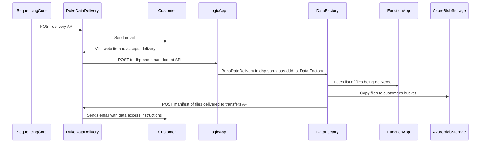

# Duke Data Delivery - Azure

## Sequencing Core
Sequencing core staff use the command line and some python scripts on a OIT Linux VM at Duke.
These scripts use azcopy to upload data files to AzureBlobStorage.
Another python script POST to DukeDataDelivery to begin the delivery to the customer.

## Duke Data Delivery (aka D4S2)
Website that allows users to deliver data to their customers. This website runs on a DHTS Linux VM at Duke.

## Customer
Sequencing core customer(PI) that needs to take ownership of the data. The PI's lab members will need to download the data.

## Logic App
The Logic App runs inside the Azure Cloud. It listens for a POST message and passes the payload into the DataFactory. [Logic App documentation](https://docs.microsoft.com/en-us/azure/logic-apps/logic-apps-overview).

# Data Factory
The Data Factory runs inside the Azure Cloud. It uses a `Copy data` activity to copy files from the Sequencing Core container to the Customer's container. It calls a Function App to retrieve metadata including a checksum about the files being delivered.
[Data Factory documentation](https://docs.microsoft.com/en-us/azure/data-factory/introduction).

# Function App    
The Function App runs inside the Azure Cloud. It uses Azure python libraries to list files in the container and lookup the MD5 checksum values.

# Azure Blob Storage   
Data is stored in Azure Data Lake Storage Gen2. The Sequencing Core and Customer will have containers (potentially in different storage accounts) to hold data. The Customer must submit a SNOW ticket to request the storage.
