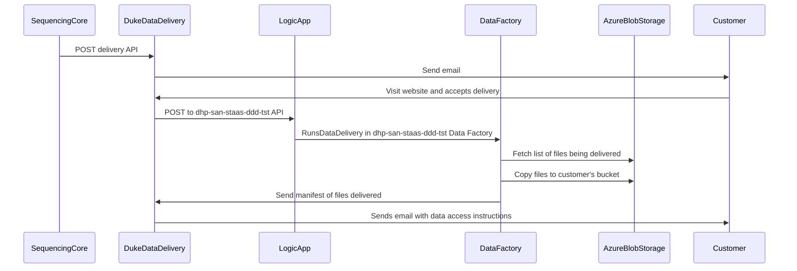

# Duke Data Delivery - Azure

```mermaid
sequenceDiagram
    participant SequencingCore
    participant DukeDataDelivery
    participant LogicApp
    participant DataFactory
    participant AzureBlobStorage    
    participant Customer
    SequencingCore->>DukeDataDelivery: POST delivery API
    DukeDataDelivery->>Customer: Send email
    Customer->>DukeDataDelivery: Visit website and accepts delivery
    DukeDataDelivery->>LogicApp: POST to dhp-san-staas-ddd-tst API
    LogicApp->>DataFactory: RunsDataDelivery in dhp-san-staas-ddd-tst Data Factory
    DataFactory->>AzureBlobStorage: Fetch list of files being delivered
    DataFactory->>AzureBlobStorage: Copy files to customer's bucket 
    DataFactory->>DukeDataDelivery: Send manifest of files delivered
    DukeDataDelivery->>Customer: Sends email with data access instructions
```
