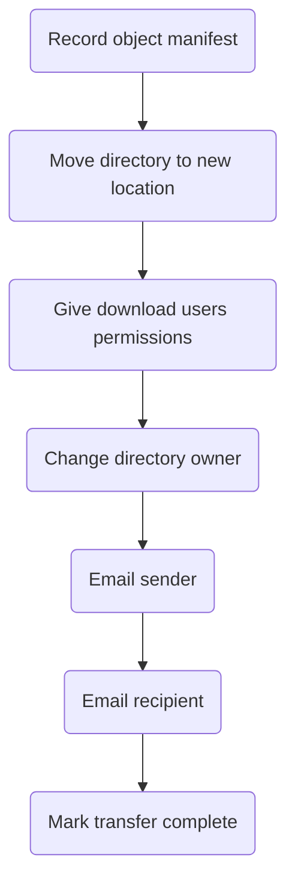
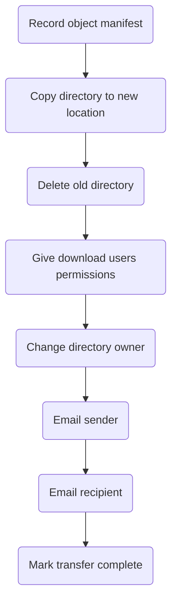

# Azure Cloud Delivery Details

## Bucket/Container organization

## Delivery within a single bucket container

```mermaid
  graph TD;
      A(Record object manifest)-->B;
      B(Move directory to new location)-->C;
      C(Give download users permissions)-->D;
      D(Change directory owner)-->E;
      E(Email sender)-->F;
      F(Email recipient)-->G(Mark transfer complete);      
```

## Delivery across buckets

```mermaid
  graph TD;
      A(Record object manifest)-->B;
      B(Copy directory to new location)-->C;
      C(Delete old directory)-->D;
      D(Give download users permissions)-->E;
      E(Change directory owner)-->F;
      F(Email sender)-->G;
      G(Email recipient)-->H(Mark transfer complete);      
```
